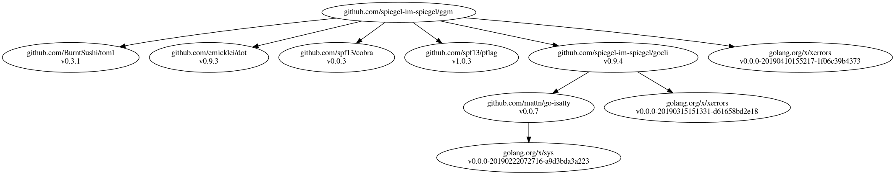

# [ggm] - Graph of Go Modules

[](https://raw.githubusercontent.com/spiegel-im-spiegel/ggm/master/LICENSE)
[](https://github.com/spiegel-im-spiegel/ggm/releases/latest)

## Download and Install

```
$ go get github.com/spiegel-im-spiegel/ggm@latest
```

## Usage

```
$ go mod graph | ggm | dot -Tpng -o ggm.png
```



[ggm]: https://github.com/spiegel-im-spiegel/ggm "spiegel-im-spiegel/ggm: Graph of Go Modules"
